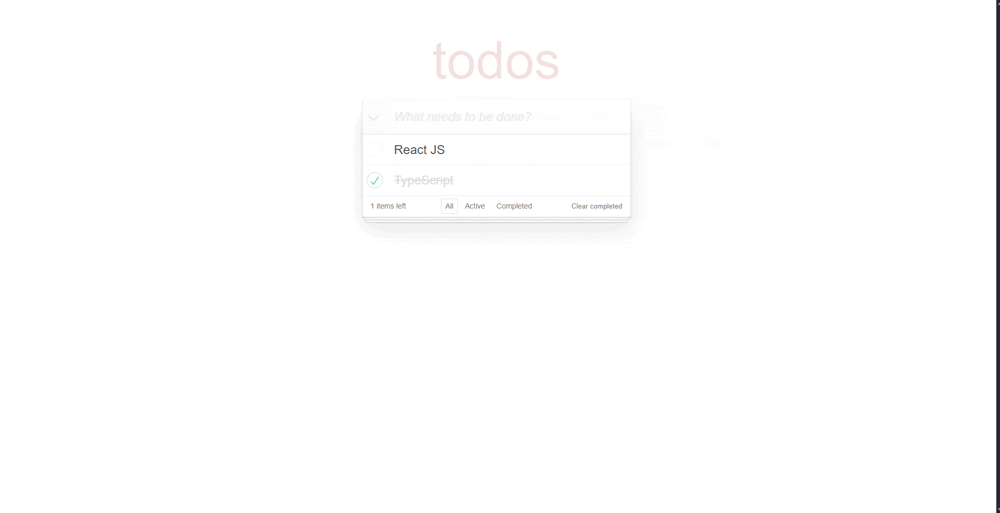

# To-do App

## Table of contents

- [Overview](#overview)
  - [The challenge](#the-challenge)
  - [Screenshot](#screenshot)
  - [Links](#links)
- [Built with](#built-with)
- [Author](#author)

## Overview

### The challenge

Users should be able to:
- Add, rename, and delete todos
- Mark todo as completed/active
- Clear completed todos
- Filter todos by status
- Toggle the status of all todos

### Screenshot

### Links

- [Solution URL](https://github.com/hma-3/todo-app-with-api)
- [Live Site URL](https://hma-3.github.io/todo-app-with-api/)

## Built with

- React
- TypeScript
- REST API
- Bulma

## Author

- GitHub - [hma-3](https://github.com/hma-3)
- LinkedIn - [Mariia Hula](www.linkedin.com/in/mariia-hula-014001332)
- Telegram - [mariia_hula](https://t.me/mariia_hula)
- E-mail - [mariia.hula.work@gmail.com](mailto:mariia.hula.work@gmail.com)
